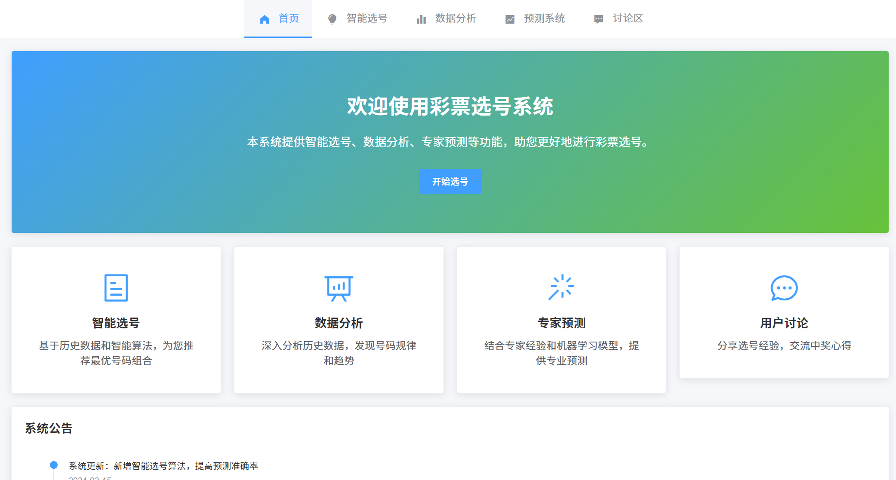
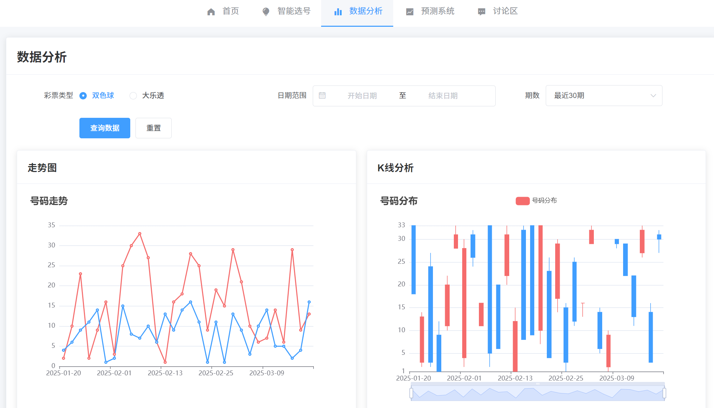
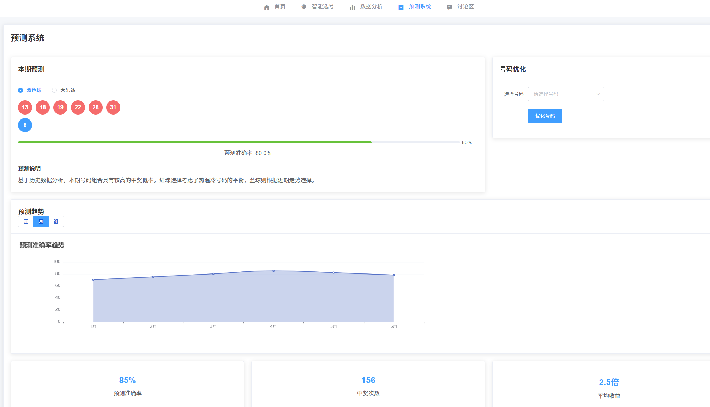

# 彩票选号系统

一个基于 Vue.js 和 Flask 的智能彩票选号系统，提供数据分析、智能预测和社区讨论功能。

## 功能特点

- 📊 数据分析：展示历史数据趋势和统计信息
- 🔮 智能预测：基于机器学习算法的号码预测
- 💬 社区讨论：用户交流和经验分享
- 📱 响应式设计：支持各种设备访问
- 🚀 性能优化：采用多种优化策略提升加载速度

## 项目截图

### 首页


### 选号功能


### 数据分析


### 智能预测


### 社区讨论


## 技术栈

### 前端
- Vue.js 2.7
- Element UI
- Axios
- Vue Router
- Webpack

### 后端
- Python 3.8+
- Flask
- Pandas
- NumPy
- Scikit-learn

### 部署
- Nginx
- Gunicorn

## 快速开始

1. 克隆项目
```bash
git clone https://github.com/soundworks123/lottery-picker.git
cd lottery-picker
```

2. 安装依赖
```bash
# 后端
cd backend
python -m venv .venv
.venv\Scripts\activate
pip install -r ../backup/requirements.txt

# 前端
cd ../frontend
npm install
```

3. 启动服务
```bash
# 后端
cd backend
python app.py

# 前端
cd frontend
npm run serve
```

4. 访问系统
- 前端：http://localhost:8080
- 后端API：http://localhost:5000

## 项目结构

```
lottery-picker/
├── frontend/          # 前端项目
│   ├── src/          # 源代码
│   ├── public/       # 静态资源
│   └── nginx.conf    # Nginx配置
├── backend/          # 后端项目
│   ├── app.py       # 主程序
│   └── data/        # 数据文件
└── backup/          # 备份文件
```

## 部署说明

详细的部署说明请参考 [部署文档](backup/README.md)

## 贡献指南

1. Fork 项目
2. 创建特性分支 (`git checkout -b feature/AmazingFeature`)
3. 提交更改 (`git commit -m 'Add some AmazingFeature'`)
4. 推送到分支 (`git push origin feature/AmazingFeature`)
5. 创建 Pull Request

## 许可证

本项目采用 MIT 许可证 - 查看 [LICENSE](LICENSE) 文件了解详情

## 联系方式

- 项目维护者：[Chao Jun]
- 邮箱：[chaojun58@outlook.com]

## 致谢

感谢所有为这个项目做出贡献的开发者！ 
