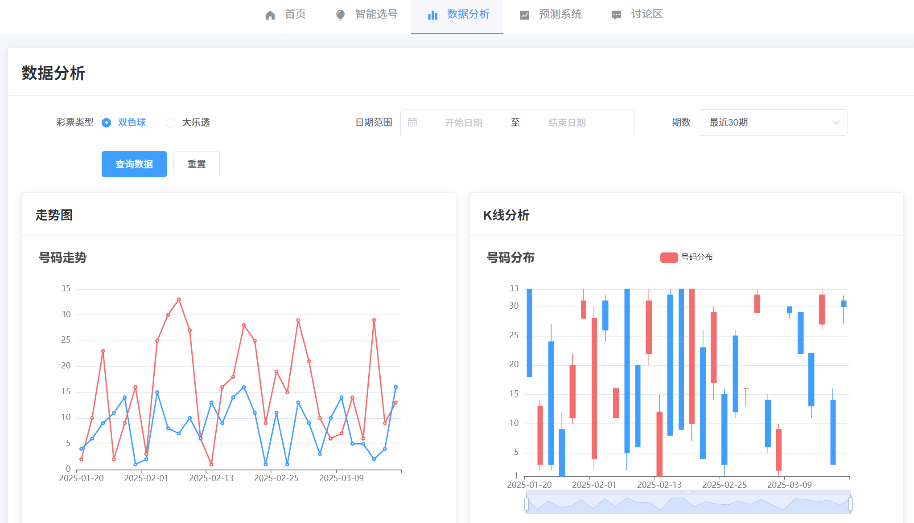

# 项目截图说明

## 目录结构

```
docs/images/
├── screenshots/     # 界面截图
├── diagrams/       # 架构图
└── examples/       # 示例图片
```

## 截图说明

### 1. 界面截图

#### 1.1 首页
- 文件：`screenshots/home.png`
- 说明：展示系统主要功能入口和最新动态
- 预览：
  

#### 1.2 选号页面
- 文件：`screenshots/lottery.png`
- 说明：展示智能选号功能界面
- 预览：
  

#### 1.3 数据分析页面
- 文件：`screenshots/analysis.png`
- 说明：展示历史数据分析和统计图表
- 预览：
  

#### 1.4 预测系统页面
- 文件：`screenshots/prediction.png`
- 说明：展示智能预测功能界面
- 预览：
  

#### 1.5 社区讨论页面
- 文件：`screenshots/discussion.png`
- 说明：展示用户讨论区界面
- 预览：
  

### 2. 架构图

#### 2.1 系统架构图
- 文件：`diagrams/architecture.png`
- 说明：展示系统整体架构设计

#### 2.2 数据库设计图
- 文件：`diagrams/database.png`
- 说明：展示数据库表结构设计

### 3. 示例图片

#### 3.1 选号结果示例
- 文件：`examples/lottery-result.png`
- 说明：展示智能选号结果示例

#### 3.2 数据分析示例
- 文件：`examples/analysis-result.png`
- 说明：展示数据分析结果示例

## 截图规范

1. 分辨率要求
   - 界面截图：1920x1080 或更高
   - 架构图：建议使用矢量图格式（SVG/PDF）
   - 示例图片：根据实际需求调整

2. 命名规范
   - 使用小写字母
   - 单词间用连字符（-）分隔
   - 使用有意义的描述性名称

3. 格式要求
   - 界面截图：PNG 格式
   - 架构图：SVG/PDF 格式
   - 示例图片：PNG/JPG 格式

4. 文件大小
   - 单个文件不超过 2MB
   - 建议使用图片压缩工具优化

## 更新记录

### 2025-03-19
- 创建文档结构
- 添加基础截图说明 